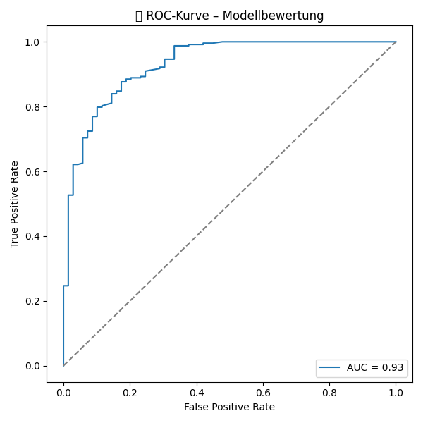

# Game of Thrones Character Survival Prediction

Ein Machine-Learning-Projekt, das vorhersagt, ob ein Charakter aus _Game of Thrones_ lebt oder gestorben ist – basierend auf biografischen Informationen, Buchauftritten und Todesdaten. Ziel ist ein interpretierbares Modell mit hoher Vorhersagekraft.

## Projektübersicht

Dieses Projekt besteht aus zwei Teilen:

### 1. `merge.py`

Führt zwei CSV-Dateien zu einem erweiterten Datensatz zusammen:

- `game_of_thrones_train.csv`: Basisdaten zu Charakteren
- `game_of_thrones_character_deaths.csv`: Zusätzliche Features wie Todesjahr, Buch des Todes etc.

Ergebnis: `got_merged_dataset.csv` mit deutlich mehr relevanten Spalten für die ML-Vorhersage.

```bash
python3 merge.py
```

### 2. `main.py`

Trainiert ein Random Forest Modell zur Vorhersage von `isAlive` (lebt der Charakter?) und bewertet es.

```bash
python3 main.py
```

## Voraussetzungen

Installiere die notwendigen Libraries:

```bash
pip install pandas scikit-learn matplotlib seaborn imbalanced-learn shap
```

## Feature Engineering (Ausschnitt)

- Anzahl lebender Familienmitglieder (`alive_family`)
- Auftrittsanzahl in den 5 Büchern
- Titel-Kennzeichen (z. B. `is_knight`, `is_royalty`)
- Alter, Haus, Kultur (mit Gruppierung seltener Werte)
- Todesinformationen (`is_dead`, `book_of_death`)

## Modell & Bewertung

- **Modell**: RandomForestClassifier mit GridSearchCV und AUC als Metrik
- **Datenungleichgewicht** wird mit **SMOTE** ausgeglichen
- **Bewertung** mit Confusion Matrix, ROC-Kurve, Klassifikationsbericht, SHAP-Analyse

### Beispielausgabe:

```text
Beste Parameterkombination:
{'max_depth': 20, 'max_features': 'sqrt', 'min_samples_leaf': 1, 'min_samples_split': 2, 'n_estimators': 100}

Beste AUC-Score:
0.975
```

### Confusion Matrix:

```
[[ 49  20]
 [ 20 223]]
```

## Ergebnisse

Das Modell erreicht eine sehr gute **AUC von ~0.93**, was auf eine fast perfekte Trennung zwischen lebenden und toten Charakteren hinweist.



### Confusion Matrix:

Zusätzlich wird eine Datei `got_model_results.csv` mit allen Vorhersagen und Wahrscheinlichkeiten gespeichert.

## Struktur

```
.
├── merge.py                  # Daten zusammenführen
├── main.py                   # ML-Modell trainieren + bewerten
├── got_model_results.csv     # Ausgabe der Vorhersagen
├── got_merged_dataset.csv    # Erweiterter Datensatz
├── game_of_thrones_train.csv
```

## SHAP Explainability

Am Ende wird mit **SHAP** die Feature-Wichtigkeit visualisiert, um zu verstehen, welche Merkmale den größten Einfluss auf die Vorhersage haben.

## Hinweise

- Falls bestimmte Spalten fehlen, werden sie im Skript abgefangen und mit Dummywerten ersetzt.
- Unicode-Warnungen „Glyph missing from font“ kannst du ignorieren – betrifft nur Emojis in Plots.
