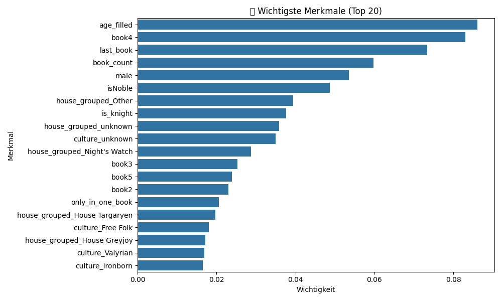
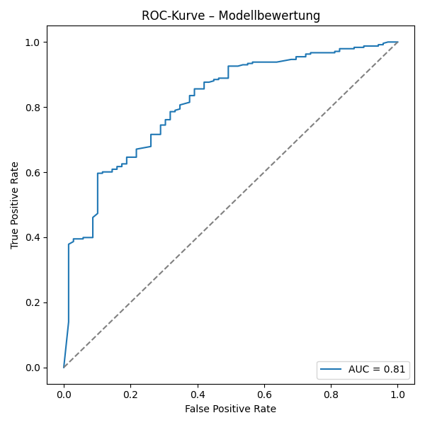
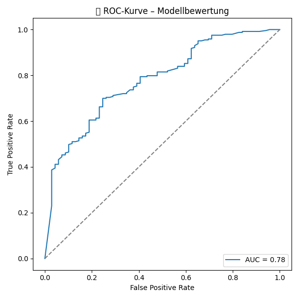
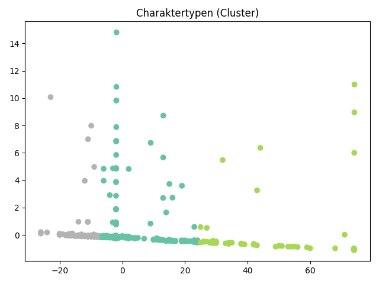

# Game of Thrones – Survival Prediction

Ein Machine-Learning-Projekt zur Vorhersage, ob ein Charakter aus _Game of Thrones_ überlebt oder stirbt – basierend auf biografischen Merkmalen, Buchauftritten und kontextuellen Features. Ziel ist ein interpretierbares, robustes Klassifikationsmodell.

---

## Projektüberblick

Das Projekt besteht aus drei Teilen:

### 1. `merge.py` – Datensatz erweitern

Führt zwei CSV-Dateien zu einem umfangreicheren Datensatz zusammen:

- `game_of_thrones_train.csv` – Basisinformationen zu Charakteren
- `game_of_thrones_character_deaths.csv` – zusätzliche Todesdaten

Ergebnis: `got_merged_dataset.csv` mit erweiterten Features.

```bash
python3 merge.py
```

### 2. `main.py` – Modelltraining & Analyse

Trainiert ein Random-Forest-Modell zur Vorhersage der Zielvariable isAlive und analysiert die Ergebnisse inkl. Visualisierungen.

```bash
python3 main.py
```

## Voraussetzungen

Installiere die benötigten Python-Bibliotheken:

```bash
pip install pandas scikit-learn matplotlib seaborn imbalanced-learn shap
```

## Feature Engineering (Auswahl)

- Lebende Angehörige (`alive_family`)
- Buchauftritte (`book1` bis `book5`)
- Titelmerkmale (`is_knight`, `is_royalty`, `is_maester`)
- Gruppierte Kategorien (`house_grouped`, `allegiance_grouped`)
- Zeitpunkt des ersten Auftritts (`introduced_late`)
- Historie toter Verwandter (`has_dead_relatives`, `many_dead_relatives`)

## Modell & Bewertung

- **Modell**: `RandomForestClassifier` mit Hyperparameter-Optimierung via `GridSearchCV`
- **Datenungleichgewicht**: ausgeglichen mit SMOTE
- **Metrik**: ROC-AUC
- **Bewertung**: Confusion Matrix, Klassifikationsbericht, ROC-Kurve, SHAP-Analyse

### Beispielausgabe:

```text
Beste Parameterkombination:
{'max_depth': 20, 'max_features': 'sqrt', 'min_samples_leaf': 1, 'min_samples_split': 2, 'n_estimators': 100}

Beste AUC-Score:
0.975
```

## Ergebnis-Visualisierungen

### Wichtigste Merkmale

Am Anfang werden die wichtigsten Merkmale visualisiert, die das Modell für Entscheidungen verwendet hat.


### ROC-Kurve



### Confusion Matrix



### Charaktertypen



### Ausgabe-Dateien

Nach dem Training wird eine CSV gespeichert:

```bash
got_model_results_clean.csv
```

Diese enthält:

- Name & ID des Charakters
- Wahrscheinlichkeiten für Leben/Tod
- Vorhersage & tatsächlicher Zustand

### 3. `got_predictor_app.py` – Interaktive Vorhersage-App (Streamlit)

Mit dieser App kannst du deinen eigenen Game-of-Thrones-Charakter zusammenstellen und vorhersagen lassen, ob er überlebt.

Die Web-App basiert auf Streamlit und verwendet das zuvor trainierte Modell (`model.pkl` + `feature_columns.pkl`).

Start per Terminal:

```bash
streamlit run got_predictor_app.py
```

#### Features:

- Eingabe von Geschlecht, Alter, Haus, Kultur, Titel etc.
- Automatische One-Hot-Kodierung
- Modell-Vorhersage + Wahrscheinlichkeiten

**Beispielansicht**:

Voraussetzungen (zusätzlich zu den ML-Bibliotheken):

```bash
pip install streamlit
```

Die App ist bewusst so gestaltet, dass sie robust auch bei nicht vorhandenen Features funktioniert („safe one-hot encoding“) und keine Data-Leakage-Infos verwendet.

Fehlen bestimmte Spalten, werden sie automatisch durch neutrale Werte ersetzt.
Warnungen wie „Glyph missing from font“ können ignoriert werden – sie betreffen nur Emojis in Plots.
Dieses Projekt nutzt ausschließlich Informationen, die vor dem Tod der Figuren realistisch verfügbar wären (kein Data Leakage).
