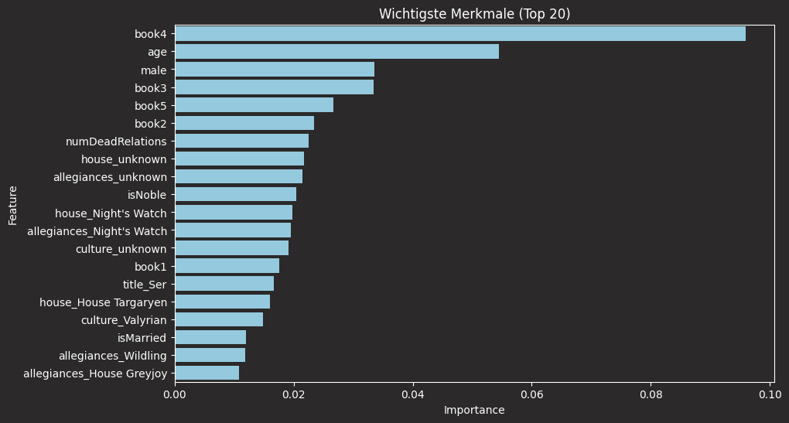
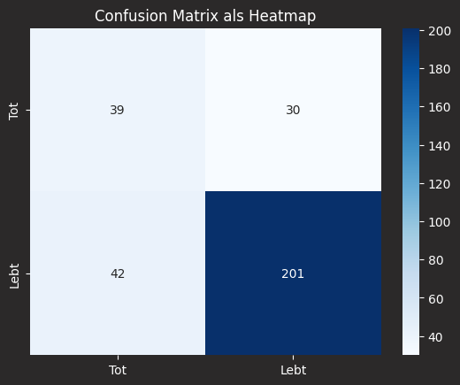
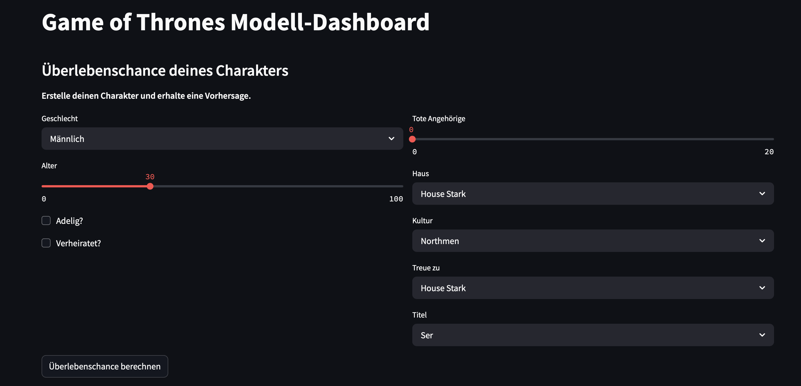

# Game of Thrones – Survival Prediction

Ein Machine-Learning-Projekt zur Vorhersage, ob ein Charakter aus _Game of Thrones_ überlebt oder stirbt – basierend auf biografischen Merkmalen, Buchauftritten und kontextuellen Features. Ziel ist ein interpretierbares, robustes Klassifikationsmodell.

---

## Projektüberblick

Das Projekt besteht aus drei Teilen:

### 1. `merge.py` – Datensatz erweitern

Führt zwei CSV-Dateien zu einem umfangreicheren Datensatz zusammen:

- `game_of_thrones_train.csv` – Basisinformationen zu Charakteren
- `game_of_thrones_character_deaths.csv` – zusätzliche Todesdaten

Ergebnis: `got_merged_dataset.csv` mit erweiterten Features.

```bash
python3 merge.py
```

### 2. `main.py` – Modelltraining & Analyse

Trainiert ein Random-Forest-Modell zur Vorhersage der Zielvariable isAlive und analysiert die Ergebnisse inkl. Visualisierungen.

```bash
python3 main.py
```

#### Voraussetzungen

Installiere die benötigten Python-Bibliotheken:

```bash
pip install pandas scikit-learn matplotlib seaborn imbalanced-learn shap
```

#### Feature Engineering (Auswahl)

- Lebende Angehörige (`alive_family`)
- Buchauftritte (`book1` bis `book5`)
- Titelmerkmale (`is_knight`, `is_royalty`, `is_maester`)
- Gruppierte Kategorien (`house_grouped`, `allegiance_grouped`)
- Zeitpunkt des ersten Auftritts (`introduced_late`)
- Historie toter Verwandter (`has_dead_relatives`, `many_dead_relatives`)

#### Modell & Bewertung

- **Modell**: `RandomForestClassifier` mit Hyperparameter-Optimierung via `GridSearchCV`
- **Datenungleichgewicht**: ausgeglichen mit SMOTE
- **Metrik**: ROC-AUC
- **Bewertung**: Confusion Matrix, Klassifikationsbericht, ROC-Kurve, SHAP-Analyse

#### Beispielausgabe:

```text
Beste Parameterkombination:
{'max_depth': 20, 'max_features': 'sqrt', 'min_samples_leaf': 1, 'min_samples_split': 2, 'n_estimators': 100}

Beste AUC-Score:
0.975
```

#### Ausgabe-Dateien

Nach dem Training wird eine CSV gespeichert:

```bash
got_model_results_clean.csv
```

Diese enthält:

- Name & ID des Charakters
- Wahrscheinlichkeiten für Leben/Tod
- Vorhersage & tatsächlicher Zustand

### 3. `visualizations.py` – Grafikerstellung

Generiert automatisch alle Modellgrafiken:

- Feature Importance
- ROC-Kurve
- - Confusion Matrix
- SHAP & PDP
- Korrelationen, Histogramme, Cluster etc.

```bash
pip python visualizations.py
```

#### Wichtigste Merkmale

Wichtigste Einflussmerkmale


#### ROC-Kurve


#### Confusion Matrix



#### Kalibrierung des Modells


#### Partial Dependence Plot (PDP)


### 4. `app.py` – Interaktive Vorhersage-App (Streamlit)

Ein vollständiges Streamlit-Dashboard mit:

- Galerie aller wichtigen Visualisierungen
- Navigation via Sidebar oder Bildklick
- Modell-Vorhersage mit interaktiver Eingabe
- Feature-Analyse und Kontext-Interpretationen



Start per Terminal:

```bash
streamlit run got_predictor_app.py
```

**Voraussetzungen:**

```bash
pip install pandas scikit-learn matplotlib seaborn imbalanced-learn shap streamlit
```

#### Visualisierungen & Interpretation:

Das Dashboard enthält mehr als 15 Visualisierungen, die helfen, das Modell zu verstehen und kritisch einzuordnen:

##### Übersicht

| Thema                                                | Beschreibung                                                     |
| ---------------------------------------------------- | ---------------------------------------------------------------- |
| Feature Importance                                   | Welche Merkmale beeinflussen die Vorhersage am stärksten?        |
| Confusion Matrix                                     | Wie oft liegt das Modell richtig oder falsch?                    |
| ROC-Kurve                                            | Wie trennscharf ist das Modell über verschiedene Schwellenwerte? |
| Überlebenswahrscheinlichkeiten                       | Wie sicher ist sich das Modell bei seinen Prognosen?             |
| PDP (Partial Dependence Plot)                        | Wie wirkt sich ein einzelnes Merkmal auf die Vorhersage aus?     |
| Kumulative Feature-Wichtigkeit                       | Wie viel erklären die wichtigsten Features allein?               |
| Clusteranalyse                                       | Gibt es typische Figurengruppen im Merkmalsraum?                 |
| t-SNE: Tot vs. Lebendig                              | Liegen Lebende und Tote im Merkmalsraum sichtbar getrennt?       |
| Überleben nach Haus, Geschlecht, Alter, Adel, Heirat | Explorative Einblicke in mögliche Muster und Verzerrungen        |
| Einführungskapitel vs. Überleben                     | Wird ein Charakter später eingeführt, überlebt er länger?        |
| Korrelationen zwischen Features                      | Gibt es redundante oder stark abhängige Merkmale?                |

**Voraussetzungen** (zusätzlich zu den ML-Bibliotheken):

```bash
pip install streamlit
```

Die App ist bewusst so gestaltet, dass sie robust auch bei nicht vorhandenen Features funktioniert („safe one-hot encoding“) und keine Data-Leakage-Infos verwendet.

Fehlen bestimmte Spalten, werden sie automatisch durch neutrale Werte ersetzt.
Warnungen wie „Glyph missing from font“ können ignoriert werden – sie betreffen nur Emojis in Plots.
Dieses Projekt nutzt ausschließlich Informationen, die vor dem Tod der Figuren realistisch verfügbar wären (kein Data Leakage).
